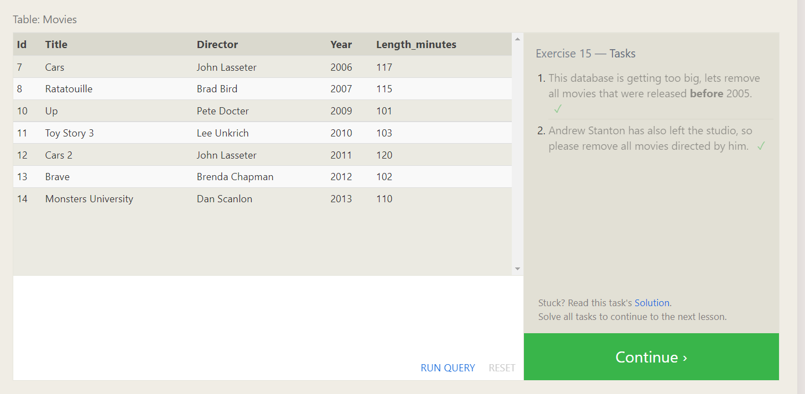

 SQL is Structured Query Language help us to manipulate, and transform data from a relational database . A relational database represents a collection of related (two-dimensional) tables.

SQL syntax and uses :

- The [SELECT](https://sqlbolt.com/lesson/select_queries_introduction) statement is used to select data from a database.

- The [WHERE](https://sqlbolt.com/lesson/select_queries_with_constraints) clause In order to filter certain results from being returned.

- The [SELECT DISTINCT](https://sqlbolt.com/lesson/filtering_sorting_query_results) statement is used to return only distinct (different) values.

- The [ORDER BY](https://sqlbolt.com/lesson/filtering_sorting_query_results) keyword is used to sort the result-set in ascending or descending order.

- A [JOIN](https://sqlbolt.com/lesson/select_queries_with_joins) clause is used to combine rows from two or more tables, based on a related column between them.

- The [INSERT INTO](https://sqlbolt.com/lesson/inserting_rows) statement is used to insert new records in a table.

- The [UPDATE](https://sqlbolt.com/lesson/updating_rows) statement is used to modify the existing records in a table.

- The [DELETE](https://sqlbolt.com/lesson/deleting_rows) statement is used to delete existing records in a table.

- The [CREATE TABLE](https://sqlbolt.com/lesson/creating_tables) statement is used to create a new table in a database.

- The [ALTER TABLE](https://sqlbolt.com/lesson/altering_tables) statement is used to add, delete, or modify columns in an existing table also used to add and drop various constraints on an existing table.

- The [DROP TABLE](https://sqlbolt.com/lesson/dropping_tables) statement is used to drop an existing table in a database.

